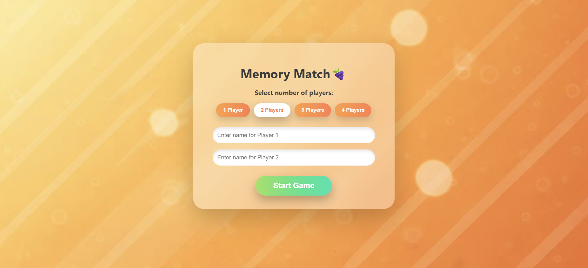
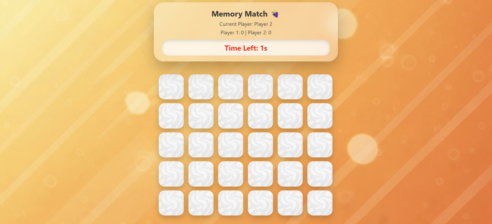

# Memory-Match-Game


A fun and interactive **Memory Match Game** built using **HTML, CSS, and Vanilla JavaScript**.  
The game supports **1–4 players**, turn-based gameplay, a countdown timer, and a final scoreboard with player rankings.

---

## 📑 Table of Contents

1. [Features](#features)  
2. [Screenshots](#screenshots)  
3. [How to Play](#how-to-play)  
4. [Images Used](#images-used)  
5. [Project Structure](#project-structure)  
6. [Built With](#built-with)  
7. [Future Enhancements](#future-enhancements)  
8. [Author](#author)  
---

## Features

- Supports **1 to 4 players** & custom player names
- Flip cards to find matching pairs
- Turn-based gameplay with automatic switching on mismatch or timeout
- Real-time score tracking 
- Final scoreboard with player rankings
- Glassmorphism UI design
- Dynamic grid layout based on number of cards

---

## Screenshots

<p align="center">
  
  
  
</p>

---

## How to Play

1. Open `index.html` in any modern web browser  
   *(or use Live Server in VS Code)*.
2. Select the number of players.
3. Enter player names.
4. Click **Start Game**.
5. Players take turns flipping two cards:
   - If the cards match, the player earns a point and continues.
   - If they don’t match, the turn switches to the next player.
6. Each turn is limited to **10 seconds**.
7. When all pairs are matched, the winner is displayed.
8. Use the scoreboard options to restart or return to player selection.

---

## Images Used

- `imgb3.jpg` → Game background image
- `imgb2.jpg` → Card back (hidden state)
- `img1.png` – `img35.png` → Card front images

> Image filenames must exactly match those used in CSS and JavaScript.

---

## Project Structure
```md
memory-match-game/
│
├── index.html              
├── style.css               
│
├── images/                
│   ├── imgb3.jpg           
│   ├── imgb2.jpg          
│   ├── img1.png            
│   ├── img2.png
│   ├── ...
│   └── img35.png            
│
└── js/                     
    ├── data.js             
    ├── game.js             
    ├── ui.js               
    ├── timer.js            
    ├── navigation.js       
    └── main.js            
```

---

## Built With

- **HTML5**  
- **CSS3** 
- **JavaScript (Vanilla JS)**
 
---

## Future Enhancements

- Sound effects  
- Improved mobile UI  
- Difficulty levels  
- Online multiplayer  
- Save high scores  

---

## Author
**Rashmi Devadiga**  
Bachelor of Computer Applications Graduate  
[LinkedIn](https://linkedin.com/in/rashmidevadiga) | [GitHub](https://github.com/rashmi-devadiga)
